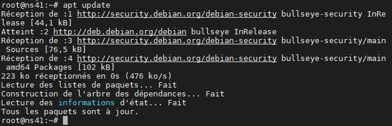

Ouvrir et paramétrer un serveur
===============================

Prérequis
*********

- Pour un bon fonctionnement, GeoNature nécessite les ressources minimum suivantes :

  - Un serveur Debian 10 ou Debian 11 architecture 64-bits
  - 4 Go RAM
  - 20 Go d’espace disque

A titre d'exemple, RNF loue ses serveurs à la société EvXOnline (https://www.evxonline.com/serveurs-vps.html). Cette société présente l'intérêt d'être facilement contactable, dispose principalement de serveurs alimentés en énergie décarbonnée, et applique une réduction de 30% aux associations par rapport à ses tarifs de base.

L'offre Starter 2018, avec 4 coeurs, 300Go d'espace disque et 8Go de RAM est amplement suffisante.

Il est important de l'accompagner d'un plan de sauvegarde, pour mettre en sûreté vos données en cas de problème du serveur (ce qui peut arriver comme sur un pc classique).

N'hésitez pas à communiquer directement avec eux pour obtenir plus d'informations.

D'autres hébergeurs peuvent vous fournir des services équivalents, dont les plus connus sont OVH ou IONOS (by 1&1).

.. _connexion-serveur :

Se connecter au serveur
***********************

Une fois que vous aurez souscris à une offre, en demandant à ce que Debian 10 ou 11 soit installé dessus, vous recevrez les identifiants pour y accéder.

Ces identifiants "root" vous donneront tous les droits sur votre serveur (vous pouvez retrouver le mot de passe root initial sur votre espace personnel de votre hébergeur).

L'administration d'un serveur se fait en ligne de commandes, il n'y a pas d'interface graphique. Cela peut être assez déroutant la première fois, mais toutes les commandes utiles vous seront détaillées ici.

Il faut, pour accéder au serveur, réaliser une connexion SSH (Secure Shell) qui est un protocole informatique de connexion sécurisée.

Depuis windows, vous pouvez télécharger une application qui vous permettra d'effectuer cette connexion. La plus connue s'appelle PuTTY (https://www.putty.org/) mais à RNF nous utilisons MobaXterm (https://mobaxterm.mobatek.net/). Cet outil présente l'intérêt de pouvoir paramétrer différents protocoles de connexion à un serveur, par exemple du FTP (File Transfer Protocol) que vous avez peut être déjà utilisé avec FileZila par exemple.

La suite de cette documentation sera détaillée sur cet outil.

Une fois téléchargé et installé, lancez MobaXterm.

Cliquez sur "Session" pour paramétrer votre connexion (1), et choisissez "SSH" (2).

Entrez l'adresse IP de votre serveur qui vous a été fournie (c'est une suite de nombre et de points) (3). Cocher la case "specify username" et tapez le ("root" la plupart du temps) (4). Enfin, cliquez sur OK.

.. image :: _static/mobaxterm_session.PNG

Vous arrivez alors sur une "console", qui vous permettra de taper les commandes que vous souhaitez :

.. image :: _static/mobaxterm_connexion.PNG

Cette session que vous venez de créer, est enregistrée dans les sessions sur MobaXterm, et vous pouvez y revenir à n'importe quel moment en cliquant sur l'onglets "sessions" (1) et en double cliquant sur la session sur laquelle vous souhaitez vous connecter. Si vous avez plusieurs serveurs à gérer, vous pouvez également les organiser par dossier.

.. image :: _static/mobaxterm_sessions.PNG

Nous allons dans un premier temps mettre à jours les dépôts Linux (Debian étant une version de Linux). Cette action à pour but de récupérer les dernières versions des logiciels et "packages" disponibles.

Pour donner une instruction au serveur, il suffit de taper une commande dans la console. Copiez donc la commande suivante et tapez sur la touche "Entrée":

.. code-block:: console

  apt update

Plusieurs lignes apparaissent les unes à la suite des autres, votre commande à bien été exécutée :

.. note::
  Pour copier/coller une commande dans une console, vous devez copier depuis votre source de manière classique (par exemple selectionner, clic droit et "copier") et simplement effectuer un clic droit dans votre console puis taper sur "Entrée" pour lancer la commande.

  Si vous copier/coller plusieurs lignes de codes, elles seront directement lancées, sauf la dernière pour laquelle il faudra à nouveau taper sur "Entrée".

Une fois ces versions récupérer, il faut lancer la commande suivante qui met à jour les logiciels et "packages" installés sur votre serveur :

.. code-block:: console

  apt upgrade

Si votre serveur est tout récent, il y a de fortes chances pour qu'il n'y ait pas grand chose à mettre à jour. Mais en ayant effectué ces commandes, on est certain d'avoir les dernières versions nécessaires pour installer différents outils, dont GeoNature.

Certains serveurs sont livrés sans “locale” (langue par défaut). Pour l’installation de GeoNature, il est nécessaire de bien configurer la locale. Tapez la commande ``locale`` :

Si vous obtenez un résultat similaire, vous pouvez passer à l'étape suivante. Sinon exécuter la commande ``dpkg-reconfigure locales``. Une fenêtre s'affiche dans votre console. Dans la liste déroulante, sélectionnez ``fr_FR.UTF-8 UTF-8`` avec ``Espace``, puis cliquez sur OK. Une 2ème fenêtre s'affiche avec une liste de locale activées (``fr_FR.UTF-8`` doit être présent dans la liste), confirmez votre choix, en cliquant sur OK, puis attendez que la locale s'installe.

.. _creer-utilisateur:

Créer un nouvel utilisateur
***************************

Vous êtes maintenant connecté à votre serveur avec l'utilisateur "root", qui est l'utilisateur administrateur du serveur, et qui donc à tous les droits.

Il est préférable de ne pas trop utiliser cet utilisateur, pour ne pas supprimer ou modifier par indavertance des fichiers essentiels au fonctionnement de votre serveur.

.. image :: _static/old-man-my-computer.gif

Pour éviter ces accidents, nous allons donc créer un nouvel utilisateur, qui aura tous les droits sur ses propres fichiers, mais qui ne pourra pas toucher aux fichiers du système (du moins pas directement).

Lancez la commande suivante pour installer l'utilitaire ``sudo`` :

.. code-block:: console

  apt install sudo

``sudo`` ("super user do") permet d'accorder à certains utilisateurs des droits d'administrateurs (nous l'utiliserons plus tard).

Tapez la commande suivante pour créer un utilisateur dédié, qui s'appellera "geonatureadmin" dans notre cas :

.. code-block:: console

  adduser geonatureadmin

Entrez les informations demandées, dont le mot de passe.

On lui attribue ensuite les droits d'administrateur en l'ajoutant au groupe ``sudo`` :

.. code-block:: console

  adduser geonatureadmin sudo

Pour la suite du processus d’installation, on utilisera l'utilisateur non privilégié nouvellement créé. Si besoin d'éxecuter des commandes avec les droits d'administrateur, on les précèdera de ``sudo``.

Il est d'ailleurs possible renforcer la sécurité du serveur en bloquant la connexion SSH au serveur avec ``root``. Voir https://docs.ovh.com/fr/vps/conseils-securisation-vps/ pour plus d'informations sur le sécurisation du serveur.

Pour passer de l’utilisateur ``root`` à ``geonatureadmin``, vous avez deux possibilité :

* Soit vous tapez la commande suivante :

  ::

    su - geonatureadmin

  Vous devrez alors relancer cette commande chaque fois que vous vous connecterez sur votre session (rappelez vous elle est configurée avec l'utilisateur "root")

* Soit vous recréez une session dans MobaXterm avec l'utilisateur geonatureadmin (vous n'aurez plus besoin de "root" pour administer GeoNature)

Créer un utilisateur a également créé un espace de stockage de fichiers sur le serveur qui lui est dédié.
De la même manière que si vous créez une session sur un ordinateur windows, vous avez le fameux "Mes documents" qui se crée, dont l'emplacement est ``C:\Users\nomdelutilisateur``.
Sur linux, ce dossier se localisera à ``/home/nomdelutilisateur`` (pour nous donc ``/home/geonatureadmin``).

.. _explorer-repertoires :

Explorer les répertoires linux
******************************

Vous pouvez utiliser la commande ``cd`` qui s'ignifie "change directory". Pour aller dans le dossier de l'utilisateur geonatureadmin, on lancera donc la commande suivante :

::

  cd /home/geonatureadmin

.. note::

  Avec la commande ``cd``, vous pouvez, au choix, partir de la racine du serveur (qui se note ``/``). Dans ce cas la plupart du temps, pour l'administration de GeoNature on tapera donc ``cd /home/geonatureadmin``.

  Vous pouvez également partir du dossier dans lequel vous vous trouvez, et vous ne taperez donc que le dossier vers lequel vous allez (par exemple, si je suis dans ``/home``, je vais taper ``cd geonatureadmin`` sans mettre le ``/`` avant).

  Petites astuces :

  * Vous pouvez taper la commande ``ls`` pour avoir la liste des dossiers enfants à partir du répertoire où vous vous situez.
  * Lorsque vous commencez à taper un répertoire enfant, appuyez sur la touche ``TAB`` pour le compléter automatiquement (par exemple, si vous commencez à taper ``/home/geon`` et tapez sur ``TAB`` vous aurez directement ``/home/geonatureadmin`` s'il n'y a pas d'autre dossier qui commence par "geon")

Vous êtes maintenant prêts à installer GeoNature sur votre serveur !
